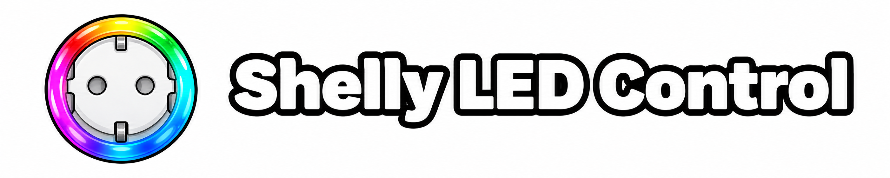

[English documentation](README.md)

# Shelly LED Control

Mit **Shelly LED Control** steuerst du die Status-LED deines Shelly Plus Plug S direkt in Home Assistant. Passe Farben, Helligkeit und Nachtmodus an – lokal im Heimnetz und ohne Cloud-Verbindung. Die Integration ergänzt die offizielle Shelly-Integration von Home Assistant.

## Funktionen

- Status-LED ein- und ausschalten, auch über Dashboards, Szenen und Automatisierungen.
- LED-Anzeige nach Leistungsaufnahme oder Ein/Aus-Zustand der Steckdose wählen.
- Eigene Farben und Helligkeiten für die eingeschaltete und ausgeschaltete Steckdose festlegen.
- Nachtmodus planen, um die LED nachts zu dimmen oder auszuschalten.
- Aktuelle LED-Helligkeit und Nachtmodus-Status anzeigen, mit Helligkeitsverlauf in Home Assistant.

## Unterstützte Geräte

Unterstützt wird der **Shelly Plus Plug S** (`SNPL-00112EU`). Andere Shelly Wall Plugs können funktionieren, werden aber nicht offiziell unterstützt. Dein Shelly muss von Home Assistant im lokalen Netzwerk erreichbar sein.

## Installation

### Mit HACS (empfohlen)

1. Installiere bei Bedarf [HACS](https://hacs.xyz).
2. Öffne in **HACS** im Drei-Punkte-Menü **Benutzerdefinierte Repositories**. Füge `https://github.com/jan-brinkmann/ha-shelly-led-control` als **Integration** hinzu.
3. Lade **Shelly LED Control** herunter und starte Home Assistant neu.

### Manuelle Installation

1. Kopiere den Ordner `custom_components/shelly_led_control` in den Ordner `custom_components` deiner Home-Assistant-Konfiguration.
2. Starte Home Assistant neu.

## Einrichtung

1. Öffne **Einstellungen → Geräte & Dienste → Integration hinzufügen** und wähle **Shelly LED Control**.
2. Gib den Hostnamen oder die IP-Adresse deines Shelly ein.
3. Behalte den voreingestellten Benutzernamen `admin` bei. Gib das Gerätepasswort ein, wenn der Anmeldeschutz aktiviert ist; andernfalls lasse es leer.

Wiederhole die Einrichtung für jeden weiteren Shelly. Geräte werden manuell hinzugefügt.

## Verwendung

Öffne das Gerät unter **Einstellungen → Geräte & Dienste → Shelly LED Control**. Die Bedienelemente kannst du auch in Dashboards, Szenen und Automatisierungen nutzen.

| Bedienelement | Was du damit machst |
| --- | --- |
| **Status-LED** | LED-Anzeige ein- oder ausschalten. |
| **LED-Anzeigemodus** | **Leistungsaufnahme** oder **Schaltzustand** wählen. Die Auswahl aktiviert die LED-Anzeige. |
| **LED-Farbe bei Relais an / aus** | Farbe und Helligkeit für beide Zustände im Modus **Schaltzustand** einstellen. Die Steckdose selbst wird dabei nicht geschaltet. |
| **Helligkeit Normalbetrieb** | Helligkeit außerhalb des Nachtmodus von 0 bis 100 % einstellen. Im Modus **Schaltzustand** gilt die Änderung für den aktuellen Ein/Aus-Zustand der Steckdose. |
| **Nachtmodus nutzen** | Zeitplan für den Nachtmodus aktivieren. |
| **Beginn / Ende Nachtmodus** und **Helligkeit Nachtmodus** | Zeitfenster und Helligkeit festlegen. Bei 0 % bleibt die LED während des Nachtmodus aus. |
| **Nachtmodus aktiv** | Prüfen, ob der geplante Nachtmodus gerade aktiv ist. |
| **Dimmwert Status-LED** | Aktuelle Helligkeit in Prozent einschließlich Nachtmodus und den Verlauf ansehen. |

Im Modus **Leistungsaufnahme** wählt Shelly die Farbe automatisch; eigene Farben sind im Modus **Schaltzustand** verfügbar. Ist die Steckdose aus, bleibt auch die Leistungsanzeige aus.

Der Nachtmodus richtet sich nach der lokalen Uhrzeit des Shelly und kann über Mitternacht laufen. **Dimmwert Status-LED** wird aus den Geräteeinstellungen und dem Gerätezustand berechnet.

Wenn du auch die offizielle Shelly-Integration nutzt, zeigt Home Assistant einen separaten Geräteeintrag für die LED-Steuerung. Das ist normal.

## Hilfe und Updates

- **Keine Verbindung?** Prüfe, ob der Shelly online und seine Weboberfläche aus dem Netzwerk von Home Assistant erreichbar ist.
- **Anmeldung fehlgeschlagen?** Prüfe das Gerätepasswort und nutze die erneute Anmeldung in Home Assistant, wenn sie angeboten wird.
- **Nachtmodus-Status unbekannt?** Prüfe, ob die Uhrzeit des Shelly korrekt eingestellt ist.
- **Einstellungen in der Shelly-Weboberfläche geändert?** Sie werden automatisch in Home Assistant übernommen; bei verzögerter Aktualisierung kann das bis zu fünf Minuten dauern.

Aktualisiere über HACS und starte Home Assistant neu, wenn du dazu aufgefordert wirst. Bei manuellen Updates ersetze den Integrationsordner und starte Home Assistant neu. Deine bestehende Einrichtung bleibt erhalten.

Technische Hintergründe findest du unter [Technische Entscheidungen](docs/architecture.md) (Englisch).

## Lizenz

Veröffentlicht unter der [MIT-Lizenz](LICENSE).
